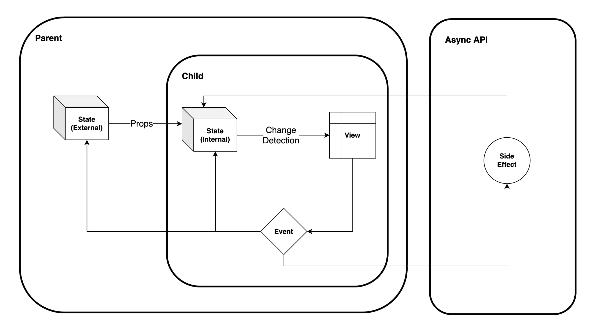

# Frontend Frameworks

## YouTube Video

[](http://www.youtube.com/watch?v=xxxxxx "Concepts Shared between 6 Frontend Frameworks | Just Enough Series")

## Comparison

|                  | React                     | Angular              | VueJs                 | AngularJs                   | SolidJs        | Svelte                     |
| ---------------- | ------------------------- | -------------------- | --------------------- | --------------------------- | -------------- | -------------------------- |
| Internal State   | `useState`                | Class Variables      | `reactive()`/`data()` | `$state`                    | `createSignal` | Variables                  |
| Shared State     | `useContext`              | Sevices/`NgRx`       | `provide`/`inject`    | Services                    | `useContext`   | `setContenxt`/`getContext` |
| Computed State   | `useMemo`                 | Function             | `computed`            | Functions                   | `createMemo`   | `$:`                       |
| Props            | Arguments/Class Variables | `@Input`             | `props`               | Class Variables             | Arguments      | `export`                   |
| Events           | Callbacks                 | `@Output`            | `$emit`               | Callbacks                   | Callbacks      | `dispatch`                 |
| Side Effects     | `useEffect`               | `ngAfterViewChecked` | `watch`               | `$watch`                    | `createEffect` | `afterUpdate`              |
| Change Detection | Virtual DOM (Fiber)       | Zones.js             | Virtual DOM (Proxy)   | $digest Cycle (Dirty Check) | Direct (N/A)   | Direct (N/A)               |

## Framework Component



### State

It's divided into:

- Internal State: Used to keep the state of a single component/container
- External State: Used to store state in an external object and use listners to update them
- Computed State: This is a state drived from another state

### Communication

Communication is trying to change the Model through the Controller and then render the View.

It's done through:

- Props: To pass data from parent to child
- Events: To pass data from child to parent

Communication should be in a one-direction flow:

- For internal communication

```
Event -> State -> Render
```

- For external communication (can be done from between child & parent or container & service)

```
Event (Child) -> Listener (Parent) -> State (Parent) -> Render (Parent) -> Render (Child)
```

### Side-effects

It's how frameworks handles side effects that are not part of the single flow of data. Usually they are done either with Life Cycle hooks or Watchers or using directives.

They can be:

- API Calls
- DOM Manipulations

### Change Detection (Reactivity)

It's how each library finds the data changes and then updates the DOM tree.

Examples are:

- Virtual DOM (React & Vue): Compare old and new dom changes using objects instead of actual DOM. React detects changes using its API and Vue uses Proxy API.
- Digest Cycle (AngularJs): Dirty checking old and new changes periodically. AngularJS runs it after `$apply` and runs dirty checking 2-10 times until changes is stable.
- Zones.js (Angular): Monkey Patching the DOM Async API methods and run changes detection when they are invoked. Angular has two CD methods: Default (Check all the components), OnPush (Only when @Input changes)
- Real binding (Svelte & SolidJs): When change is done in the state apply directly to the DOM. This is the closest to Vanilla Javascript.

## Good Articles

- [React Virtual DOM and Internals](https://reactjs.org/docs/faq-internals.html#gatsby-focus-wrapper)
- [Reactivity in Depth for VueJs](https://vuejs.org/guide/extras/reactivity-in-depth.html)
- [Understanding Zones](https://blog.thoughtram.io/angular/2016/01/22/understanding-zones.html)
- [Angular Change Detection](https://angular.io/guide/change-detection)
- [Angular Zones.js](https://angular.io/guide/zone)
- [AngularJS Digest Cycle](https://docs.angularjs.org/guide/scope)
- [Change And Its Detection In JavaScript Frameworks](https://teropa.info/blog/2015/03/02/change-and-its-detection-in-javascript-frameworks.html)
- [SolidJS Reactivity](https://www.solidjs.com/guides/reactivity)
- [Svelte Reactivity](https://svelte.dev/blog/svelte-3-rethinking-reactivity)
